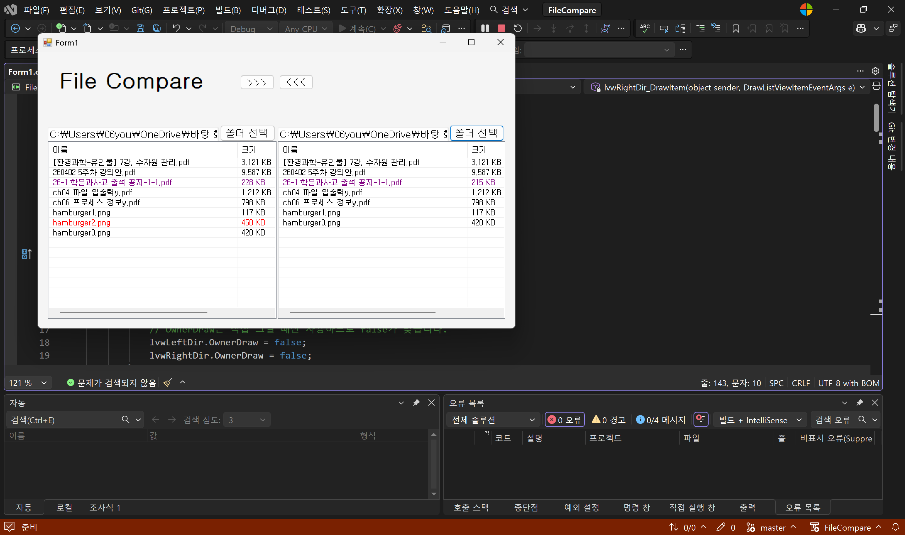
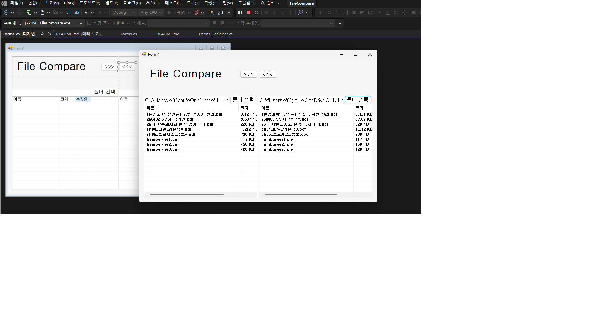
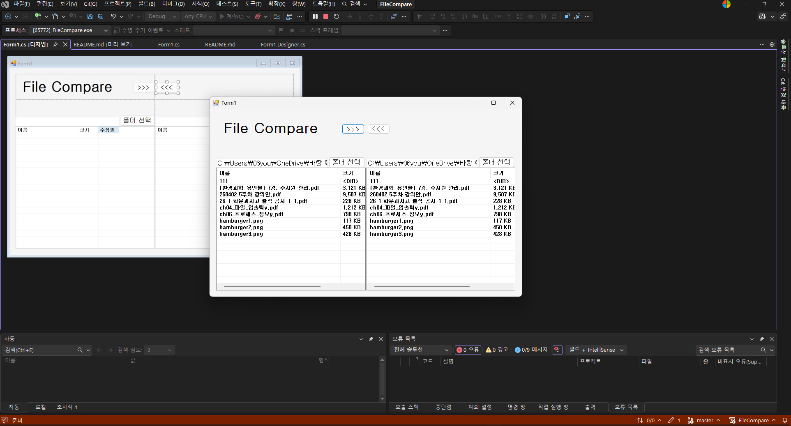

# (C# 코딩) FileCompare

## 개요 
- c# 프로그래밍 학습
- 1줄 소개 : 2개 폴더 내의 파일들을 비교하여 파일 비교 결과를 색상으로 표시하고, 파일을 복사할 수 있는 파일 비교 앱.
- 사용한 플랫폼 
	- C#, .NET Windows Forms, Visual Studio, GitHub
- 사용한 컨트롤 : 
	Label, Splitcomtainer, Panel, Listview, textbox, button 등등
- 사용한 기술과 구현한 기능:
	- Visual Studio를 이용하여UI 디자인
	- C#과 .NET Windows Forms를 이용하여 파일 비교 기능 구현
	- label, textbox, button, listview, splitcontainer 등을 이용하여 UI 구성
	- dock 속성을 이용하여 리스트뷰가 패널의 크기에 맞게 자동으로 조절되도록 함.
	- anchor 속성을 이용하여 창의 크기를 변경해도 버튼과 텍스트박스, 리스트뷰가 화면에서 잘리지 않도록 함.
	- try-catch구문을 이용하여 프로그램 실행 중에 예상치 못한 오류가 발생했을 때, 프로그램이 갑자기 꺼지지 않는 기능을 구현함. 
	- Enumeratefiles매서드를 이용하여 특정 폴더 안의 파일 목록을 하나씩 가져오는 기능을 구현함.

## 실행 화면(과제1)
- 코드의 실행 스크린샷과 구현내용 설명

- 구현한 내용(위 그림 참조)
	- UI 구성 : label, textbox, button, listview, splitcontainer를 화면에 적절히 배치.
	- listview를 양 옆에 배치하고, 맨 위에 앱 이름을 알려주는 label과 버튼, panel을 용도에 맞게 적절히 배치함.
	- panel을 3부분으로 나누어 배치하여 다른 컨트롤들을 하나로 묶어서 관리할 수 있도록 구현함.
	- anchor 속성을 이용하여 창의 크기를 변경해도 버튼과 텍스트박스, 리스트뷰가 화면에서 잘리지 않도록 함.
	- dock 속성을 이용하여 리스트뷰가 패널의 크기에 맞게 자동으로 조절되도록 함.
	

## 실행화면(과제2)
-코드의 실행 스크린샷과 구현내용 설명

- 구현한내용(위그림참조)
	- populattelistview함수를 이용하여 파일 목록을 보여주는 기능을 구현함.
	- Enumeratefiles매서드를 이용하여 특정 폴더 안의 파일 목록을 하나씩 가져오는 기능을 구현함.
	- try-catch구문을 이용하여 프로그램 실행 중에 예상치 못한 오류가 발생했을 때, 프로그램이 갑자기 꺼지지 않는 기능을 구현함. 
	- 파일 이름, 수정시간, 파일 상태를 비교하여 동일 파일은 양쪽 모두 검은색, 같은 파일 중 수정시간이 다른 파일은 빨간색과 회색으로 구분되도록 함. 
	- 단독 파일은 보라색으로 표시하여 파일의 상태를 한 눈에 확인할 수 있도록 기능을 구현함.

## 실행화면(과제3)
-코드의 실행 스크린샷과 구현내용 설명

- 구현한내용(위그림참조)
	- 양쪽 폴더에서 반대쪽 폴더로 파일을 복사할 수 있는 기능을 구현함.
	- 반대쪽 폴더로 복사한 파일은 복사하기 전 폴더의 버전으로 복사됨. 
	- 복사된 폴더는 파일의 상태가 동일한 파일로 표시되도록 구현함.
	- 위의 기능을 구현하기 위해서, listview에서 선택된 파일의 경로를 가져와서, File.Copy매서드를 이용하여 반대쪽 폴더로 파일을 복사하는 기능을 구현함.

## 실행화면(과제4)
-코드의 실행 스크린샷과 구현내용 설명

- 구현한내용(위그림참조)
	- 하위 폴더에 대해서 한 방에 비교, 복사가 가능한 기능을 구현함. 
	- 하위 폴더를 하나의 파일처럼 처리하도록 구현함. 
	- 비교, 복사된 하위 폴더가 적절하게 색상이 표시되도록 구현함. 
	- 복사 버튼을 누를 시 하위폴더의 모든 내용 (파일과 하위폴더 포함) 을 반대쪽 폴더로 복사하는 기능을 구현함.
