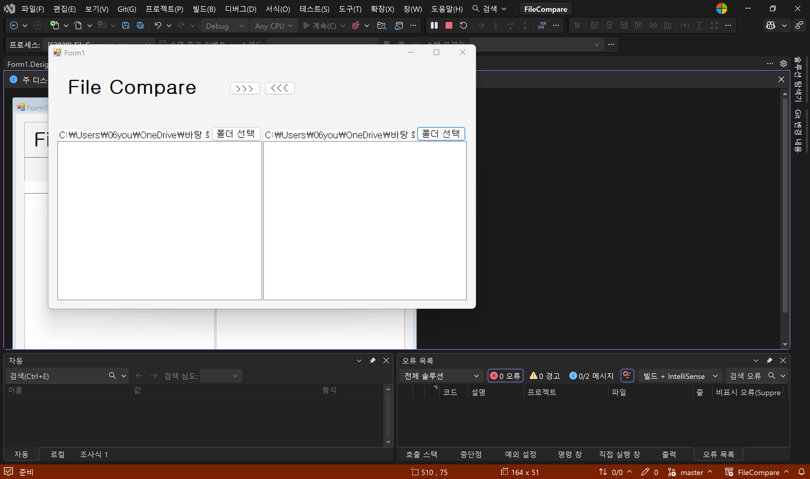

# (C# 코딩) FileCompare

## 개요 
- c# 프로그래밍 학습
- 1줄 소개 : 2개 폴더 내의 파일들을 비교하여 파일 비교 결과를 색상으로 표시하고, 파일을 복사할 수 있는 파일 비교 앱.
- 사용한 플랫폼 
	- C#, .NET Windows Forms, Visual Studio, GitHub
- 사용한 컨트롤 : 
	Label, Splitcomtainer, Panel, Listview, textbox, button 등등
- 사용한 기술과 구현한 기능:
	- Visual Studio를 이용하여UI 디자인
	- C#과 .NET Windows Forms를 이용하여 파일 비교 기능 구현
	- label, textbox, button, listview, splitcontainer 등을 이용하여 UI 구성
	- dock 속성을 이용하여 리스트뷰가 패널의 크기에 맞게 자동으로 조절되도록 함.

## 실행 화면(과제1)
- 코드의 실행 스크린샷과 구현내용 설명

- 구현한 내용(위 그림 참조)
	- UI 구성 : label, textbox, button, listview, splitcontainer를 화면에 적절히 배치.
	- listview를 양 옆에 배치하고, 맨 위에 앱 이름을 알려주는 label과 버튼, panel을 용도에 맞게 적절히 배치함.
	- panel을 3부분으로 나누어 배치하여 다른 컨트롤들을 하나로 묶어서 관리할 수 있도록 구현함.
	- anchor 속성을 이용하여 창의 크기를 변경해도 버튼과 텍스트박스, 리스트뷰가 화면에서 잘리지 않도록 함.
	- dock 속성을 이용하여 리스트뷰가 패널의 크기에 맞게 자동으로 조절되도록 함.

